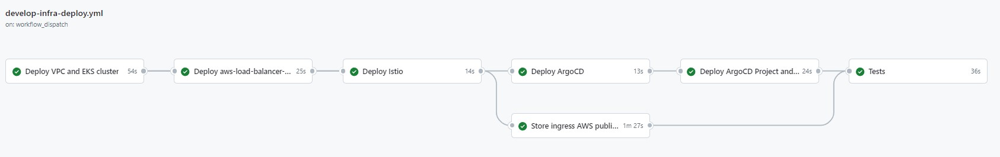
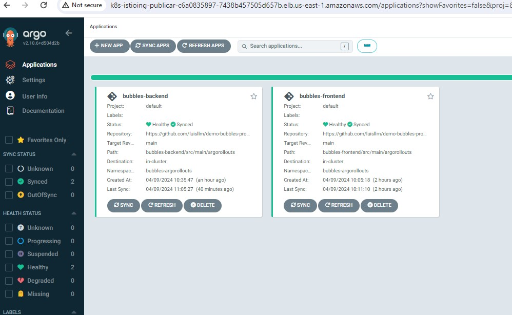
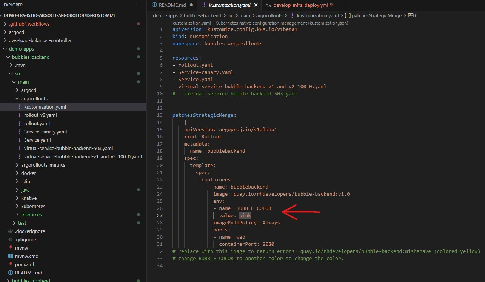
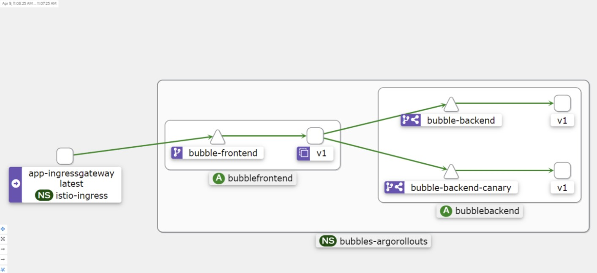
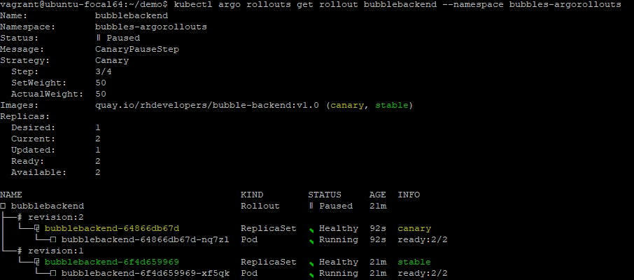
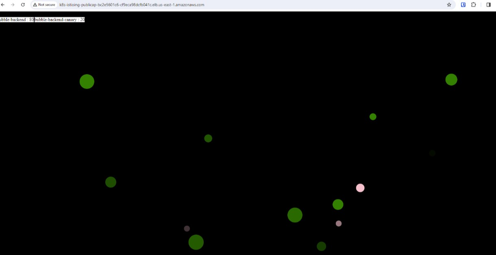

# Description

Demo that does the following:
- Deploys a VPC with an EKS cluster
- Deploys aws-load-balancer-controller
- Deploys Istio and 2 Istio Ingress Gateways, one to access ArgoCD UI and Kiali, another one to access the app/s
- Deploys monitoring: prometheus, grafana and Kiali
- Deploys ArgoCD in the EKS cluster and configures a gateway and vs to expose the ArgoCD UI via the AWS public LB and Istio IG
- Deploys the ArgoCD apps *bubbles-frontend* and *bubbles-backend*, one of which (*bubbles-frontend*)is exposed via the other AWS public NLB and the other public Istio IG
- Runs some basic tests to verify the PODs are running and it also sends a test request to the public LB
  


# Prerequisites

- S3 bucket in the Account and Region where you are deploying: <environment>-test-llm-terraform-state
  
- Terraform infra.tfvars per environment: https://github.com/luisllm/environments.git


# Access the UIs:

To access ArgoCD and Kiali UIs:
- http://<ISTIO_IG_ARGO>/
- http://<ISTIO_IG_ARGO>/kiali



To access the app:
- http://<ISTIO_IG_APP>/


# Steps to test the Canary

Command to check the status of the Rollout:
```
kubectl argo rollouts get rollout bubblebackend --namespace bubbles-argorollouts
```

Go ahead and change the color config. Commit and push the changes. ArgoCD will realize about the change and apply it:


Check Kiali:


Keep checking the progress of the rollout with the command above.


The color of the bubbles are changed gradually following the steps of the canary (specified in the Rollout):



# Pricing per environment

1 x EKS cluster
$0.10 per hour * 24h = $2.4 per day

3 x t3.small SPOT
$0.0082 per hour * 24h =  $0.0082 per day 
$0.0082 per day * 3 ec2s = $0.5904 per day

1 x NATGW
$0.045 per hour * 24h = $1.08 per day

2 x NLB 
$0.0225 per hour * 24h = $0.54 per day
$0.54 per day * 2 NLBs = $1.08 per day

TOTAL PER DAY: $2.4 + $0.5904 + $1.08 + $1.08 = $5.1504


# Options considered to have Progressive Delivery with Istio
- Option1 (the one implemented in this demo): Istio + ArgoCD + Argo Rollouts
- Option2: Istio + ArgoCD + Flagger
- Option3: Istio + Flux + Flagger


# References

ArgoCD:
- https://www.youtube.com/watch?v=AvLuplh1skA&list=PLTiQErIEf8SZsSwdDqITSPJvMDBGVJX-d&index=1
- https://www.youtube.com/watch?v=17894DTru2Y&list=PLTiQErIEf8SZsSwdDqITSPJvMDBGVJX-d&index=2

Argo Rollouts:
- https://www.youtube.com/watch?v=QHf2twZSUng
- https://github.com/redhat-developer-demos/bubbles-progressive-delivery/tree/main
- https://www.infracloud.io/blogs/progressive-delivery-service-mesh-argo-rollouts-istio/
- https://engineering.empathy.co/progressive-delivery-in-kubernetes-analysis/
- https://harpreetsingh2020.medium.com/argo-rollouts-with-istio-for-canary-deployments-669c916583f
- https://dev.to/stack-labs/canary-deployment-with-argo-cd-and-istio-406d

Next steps:
- Integrate the Argo Rollout with Istio metrics in Prometheus: 
  https://github.com/argoproj/argo-rollouts/discussions/2706
  https://argoproj.github.io/argo-rollouts/features/analysis/?ref=engineering.empathy.co
- Try this other demo:
  https://github.com/kdubois/progressive-delivery/blob/main/workloads/canary-app/rollout.yaml
   
Other interesting links:
- https://www.youtube.com/watch?v=X1qunTjXjs4
- https://engineering.empathy.co/progressive-delivery-in-kubernetes-analysis/
- https://buoyant.io/blog/flagger-vs-argo-rollouts-for-progressive-delivery-on-linkerd
- 


